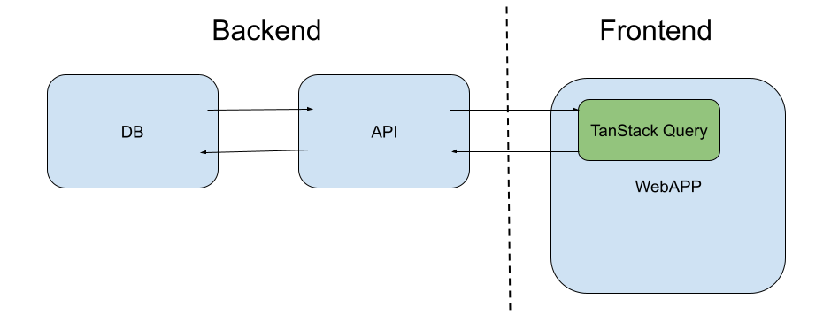

# Знакомство со стеком React, Next.js, TanStack Query, SQLite

## Установка 

1) Открыть cmd, выполнить (cклонировать проект на диск С: в личную папку (на диске G: проект не развернется):
    ```
    git clone https://github.com/sergeyvo80/vki-next
    ```

2) Открыть в VSCode, в терминале VSCode выполнить:
    ```
    Set-ExecutionPolicy -Scope CurrentUser RemoteSigned
    ```

3) Установить npm пакеты:
    ```
    npm i
    ```

4) Запустить проект:
    ```
    npm run dev
    ```

### Открыть в браузере две вкладки

http://localhost:3000/ - приложение

http://localhost:3000/api/groups - апи


## Конфигурация
1) Создать файл .env.local в корне проекта
    ```
    # .env.local
    DB="g:/db/vki-web.db"
    NEXT_PUBLIC_API="http://localhost:3000/api/"
    ```
2) Скопировать базу данных и ./db/vki-web.db в G:\db\vki-web.db

## Файловый раутинг Next.js - работает из папки src/app

[читать по ссылке](docs/next-routing.md)


## Назначение файлов

### Приложение - Frontend

- Главный шаблон (точка входа) - [src/app/layout.tsx](src/app/layout.tsx)
- Компоненты шаблона - [src/app/components/layout](src/app/components/layout)
- Страница - [src/app/groups/page.tsx](src/app/groups/page.tsx)
- Компонент - [src/components/Groups/Groups.tsx](src/components/Groups/Groups.tsx)
- Хук получения данных - [src/hooks/useGroups.tsx](src/hooks/useGroups.tsx)
- Получение данных из API - [src/api/groupsApi.ts](src/api/groupsApi.ts)

### API - Backend

- API возвращает список групп - [src/app/groups/route.ts](src/app/groups/route.ts)
- Запрос к БД - [src/db/groupDb.ts](src/db/groupDb.ts)
- Стартовая БД и запросы - папка db в корне проекта

## Работа с данными



## Инструменты
- ### [TanStackQuery - работа с данными в приложении](docs/tanstack-query.md)
- ### [БД SQLite](docs/db.md)
- ### [HTTP запросы](docs/http.md)
- ### [GIT](docs/git.md)


## Ссылки

- [Next.js Documentation](https://nextjs.org/docs) - learn about Next.js features and API.
  
- [Learn Next.js](https://nextjs.org/learn) - an interactive Next.js tutorial.

- TanStackQuery - https://tanstack.com/query/latest

- https://nextjs.org/docs/app/api-reference/file-conventions/route

