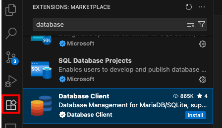
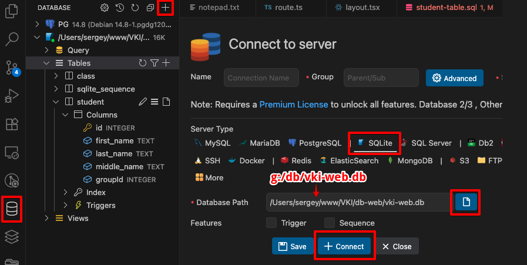
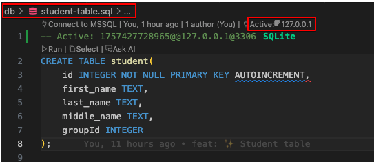
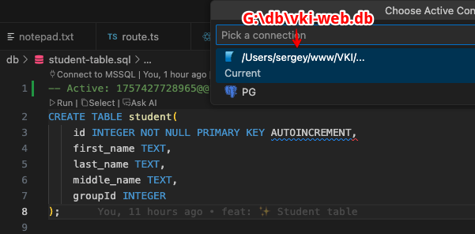
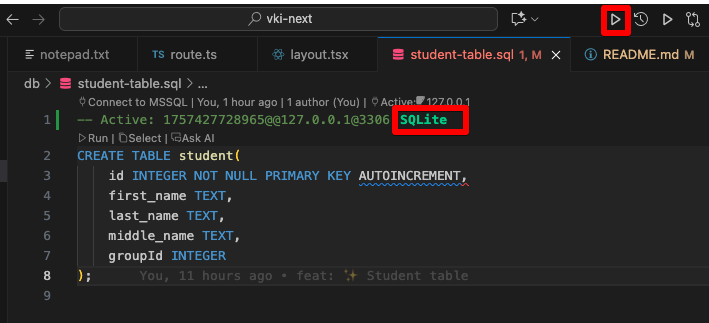

[<<< назад](../README.md)

## Работа с БД

### Установить плагин

### Подключение к БД

### Выполнение запроса

### Так же можно использовать SQLite Browser - https://sqlitebrowser.org

Portable Version https://sqlitebrowser.org/blog/portableapp-for-3-12-0-release-now-available/