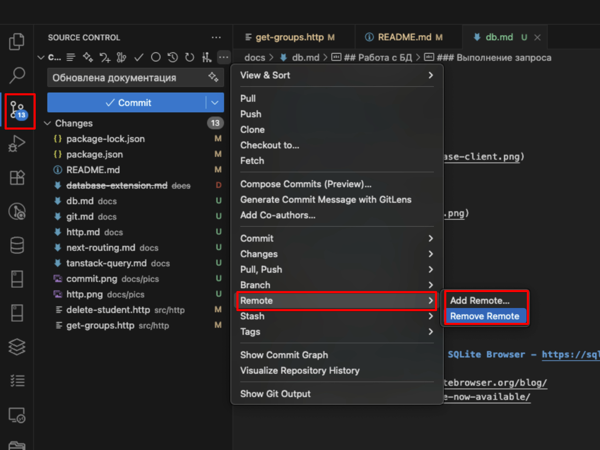
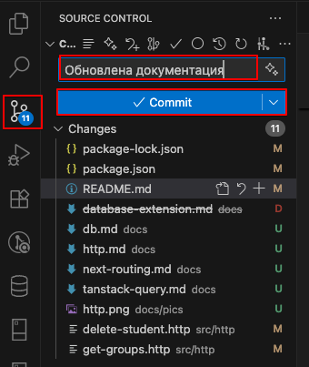
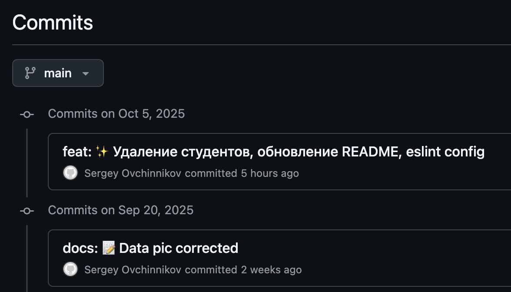
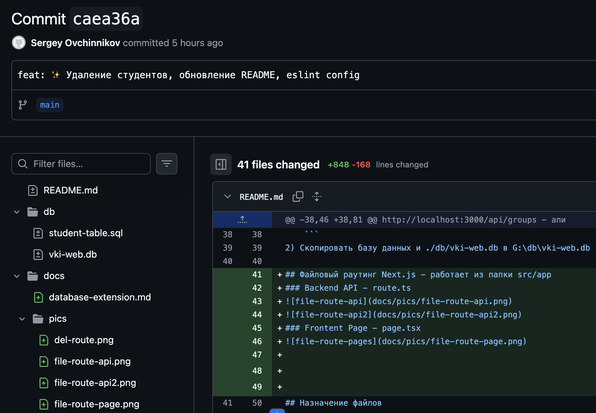

[<<< назад](../README.md)

## Клонирование проекта

Если еще нет своего репозитория 

Открыть cmd, выполнить (cклонировать проект на диск С: в личную папку (на диске G: проект не развернется):
```
git clone https://github.com/sergeyvo80/vki-next
```

## Положить в свой репозиторий на github.com
1) Создать свое пустой репозиторий на гитхабе https://github.com
2) Удалить стартовый репозиторий remote/remove remote https://github.com/sergeyvo80/vki-next
3) Добавить свой репозиторий remote/add remote


## Commit изменений
Обязательно указывайте наименования работы в коммите - например: "Добавлен раздел - студенты"



## Если произойдет ошибка нужно будет ввести email и имя
Для этого вводим в cdm свой email и имя пользователя на гитхабе.

```
git config --global user.name "Your Name"
git config --global user.email "your.email@example.com"
```

## Предоставление работ в виде коммита

