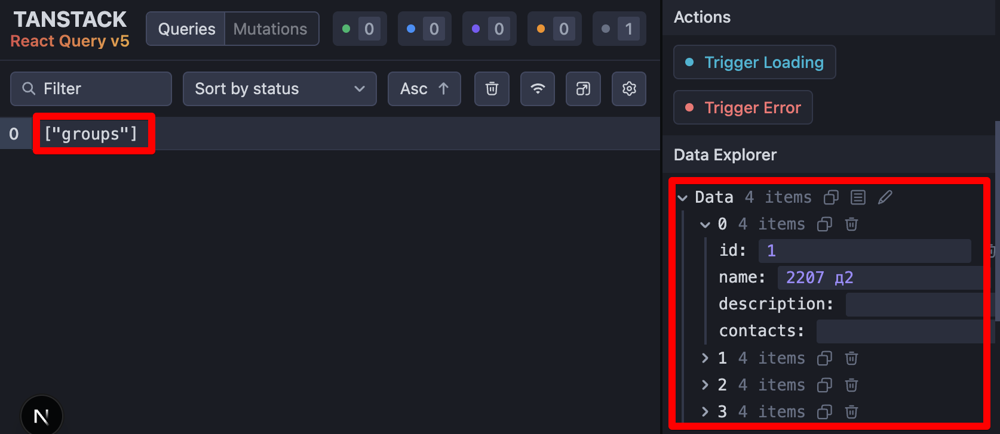

[<<< назад](../README.md)

## TanStackQuery - работа с данными в приложении
### Загрузка данных из апи - [src/api/groupsApi.ts](../src/api/groupsApi.ts)
### Загрузка данных в TanStackQuery - [src/app/layout.tsx](../src/app/layout.tsx)
```
  // выполняется на сервере - загрузка групп
  let groups: GroupInterface[];
  await queryClient.prefetchQuery({
    queryKey: ['groups'],
    queryFn: async () => {
      groups = await getGroupsApi();
      console.log('Groups', groups);
      return groups;
    },
  });
```
### Хук работы с данными - [src/hooks/useStudents.ts](../src/hooks/useStudents.ts)
### Использование хука для вывода данных и других операций - [src/components/Groups/Groups.tsx](../src/components/Groups/Groups.tsx)
```
const Groups = (): React.ReactElement => {
  const { groups } = useGroups();

  return (
    <div className={styles.Groups}>
      {groups.map((group: GroupInterface) => (
        <h2 key={group.id}>
          {group.name}
        </h2>
      ))}
    </div>
  );
};
```

## ReactQueryDevtools



